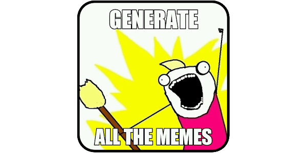

# Hello!
## This is an educational project dedicated to generating images using [openai](https://www.npmjs.com/package/openai) technology.

Main technologies:
- [React](https://www.npmjs.com/package/react)
- [Three.js](https://www.npmjs.com/package/three)
- [Valtio](https://www.npmjs.com/package/valtio)
- [Framer Motion](https://www.npmjs.com/package/framer-motion)
- [openai](https://www.npmjs.com/package/openai)
- [node](https://www.npmjs.com/package/node)
- [express](https://www.npmjs.com/package/express)

